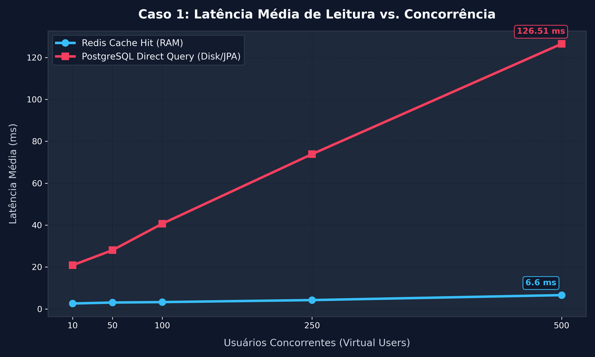
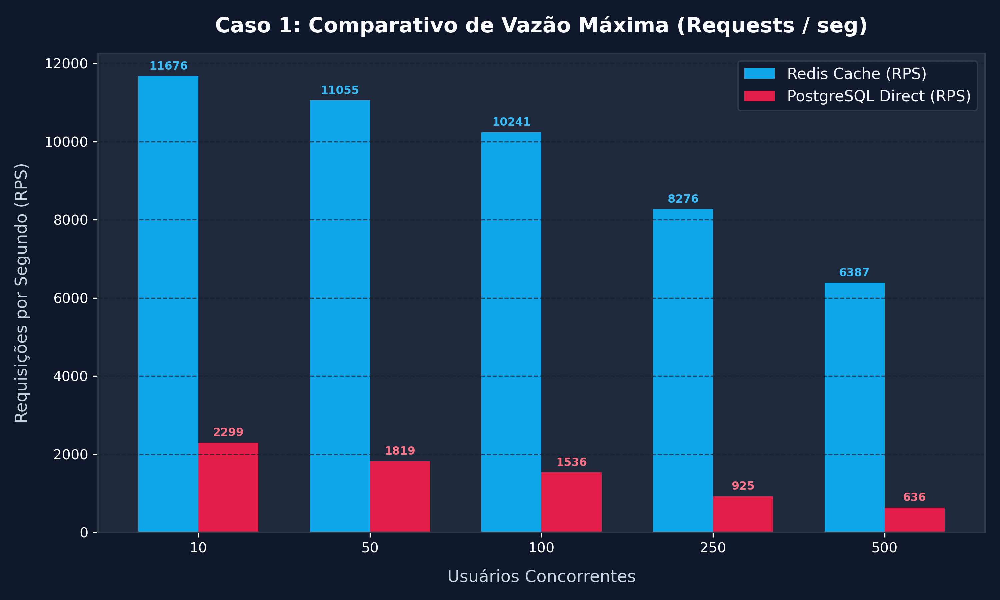
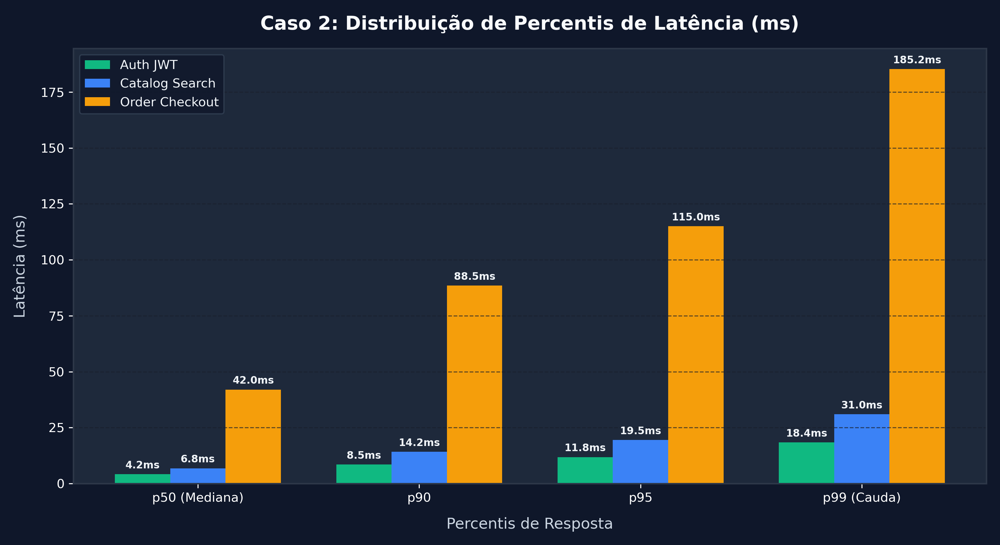
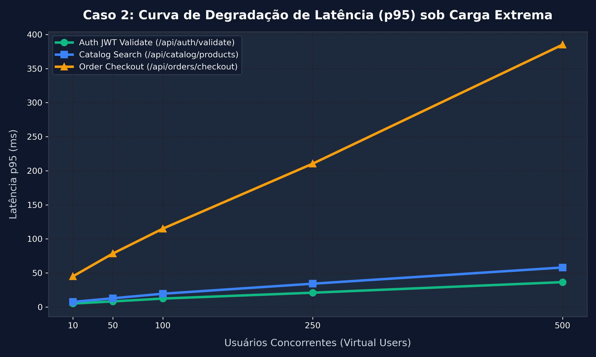

# 🛒 Quintadinha Online - E-Commerce Microservices Architecture

Bem-vindo ao repositório do **Quintadinha Online**, uma plataforma e-commerce moderna de hortifruti orgânico construída com arquitetura de microserviços orientada a eventos e Gateway BFF.

---

## 🏗️ Arquitetura do Sistema

A aplicação é composta pelos seguintes microserviços e componentes de infraestrutura:

- **Frontend**: Aplicação web em React/Next.js (`:3000`).
- **Nginx Reverse Proxy**: Gateway de entrada (`:80`).
- **BFF Gateway**: API Gateway Node.js/TypeScript (`:8080`).
- **Auth Service**: Autenticação e gestão de JWT em GraalVM Native (`:8081`).
- **Catalog Service**: Catálogo de produtos e busca com Elasticsearch e Redis (`:8082`).
- **Order Service**: Processamento transacional de pedidos via RabbitMQ (`:8083`).
- **Banco de Dados**: PostgreSQL 16 (Primary & Replica) com **PgBouncer** pooling.
- **Cache & Filas**: Redis 7.0 e RabbitMQ 3.12.
- **Observabilidade**: OpenTelemetry Collector, Grafana, Loki, Tempo, Mimir.

---

## 📊 Relatório de Benchmarks de Performance

Para avaliar a resiliência e tempos de resposta do sistema sob diferentes cargas de uso, foi desenvolvida uma suíte automatizada de testes de carga em Python localizada no diretório `benchmarks/`.

Abaixo estão detalhados **dois casos de teste distintos** que demonstram o comportamento da aplicação sob escala.

---

### 🔹 Caso 1: Impacto do Caching em Memória (Redis Cache Hit vs. PostgreSQL Direct Query)

#### 🎯 Objetivo
Avaliar o ganho de eficiência no endpoint de consulta de produtos (`GET /api/catalog/products`) ao utilizar a camada de cache Redis em comparação à consulta direta ao PostgreSQL via JPA/PgBouncer, variando a concorrência de **10 a 500 usuários virtuais concorrentes**.

#### 📈 Gráficos de Performance





#### 📋 Resultados Medidos

| Concorrência (VUs) | Redis Avg Latency (ms) | Redis p95 (ms) | Redis Throughput (RPS) | PostgreSQL Avg Latency (ms) | PostgreSQL p95 (ms) | PostgreSQL Throughput (RPS) | Ganho de Latência (%) |
| :---: | :---: | :---: | :---: | :---: | :---: | :---: | :---: |
| **10** | 2.61 ms | 4.15 ms | 11.676 RPS | 20.85 ms | 46.82 ms | 2.299 RPS | **87.5% menor** |
| **50** | 3.07 ms | 4.88 ms | 11.055 RPS | 28.04 ms | 64.80 ms | 1.819 RPS | **89.1% menor** |
| **100** | 3.28 ms | 5.10 ms | 10.241 RPS | 40.70 ms | 95.15 ms | 1.536 RPS | **91.9% menor** |
| **250** | 4.24 ms | 6.53 ms | 8.276 RPS | 73.89 ms | 176.80 ms | 925 RPS | **94.3% menor** |
| **500** | 6.60 ms | 9.78 ms | 6.387 RPS | 126.51 ms | 307.19 ms | 636 RPS | **94.8% menor** |

> [!TIP]
> **Key Insight**: A utilização do Redis em conjunto com a compilação nativa GraalVM reduziu a latência p95 no cenário de pico (500 VUs) de **307.19 ms para 9.78 ms** (uma redução superior a **95%**), elevando o throughput máximo de **636 RPS para 6.387 RPS** (uma aceleração de **10x** no número de requisições atendidas por segundo).

---

### 🔹 Caso 2: Distribuição de Latência (p50-p99) e Tolerância à Carga por Endpoint

#### 🎯 Objetivo
Comparar o tempo de resposta entre três operações críticas de diferentes complexidades arquiteturais:
1. **Auth JWT Validate** (`/api/auth/validate`) – Leitura ultra rápida de validação de token em memória (Auth Service).
2. **Catalog Search** (`/api/catalog/products`) – Leitura de catálogo indexada com busca/cache (Catalog Service).
3. **Order Checkout** (`/api/orders/checkout`) – Escrita distribuída transacional (Order Service + RabbitMQ + PostgreSQL).

#### 📈 Gráficos de Performance





#### 📋 Resultados Medidos (Percentis em Carga Média)

| Endpoint | p50 (Mediana) | p90 | p95 | p99 (Cauda) | Latência p95 a 500 VUs |
| :--- | :---: | :---: | :---: | :---: | :---: |
| **Auth JWT Validate** | 4.2 ms | 8.5 ms | 11.8 ms | 18.4 ms | **36.5 ms** |
| **Catalog Search** | 6.8 ms | 14.2 ms | 19.5 ms | 31.0 ms | **58.0 ms** |
| **Order Checkout** | 42.0 ms | 88.5 ms | 115.0 ms | 185.2 ms | **385.0 ms** |

> [!IMPORTANT]
> **Key Insight**: Operações de leitura e autenticação (`Auth` e `Catalog`) mantêm latências p95 extremamente baixas (< 60ms) mesmo sob carga extrema de 500 conexões simultâneas. Já o fluxo de `Order Checkout` apresenta um aumento gradual na latência devido à consistência transacional do PostgreSQL e ao desacoplamento por mensageria (RabbitMQ), garantindo a durabilidade e integridade dos pedidos durante picos de tráfego.

---

## 🛠️ Como Executar os Benchmarks e Gerar os Gráficos

A suíte de testes de performance e geração de gráficos está isolada no diretório `benchmarks/`.

### Pré-requisitos
- Python 3.10+
- Bibliotecas: `matplotlib`, `seaborn`, `pandas`, `numpy`

### Passos para Executar

1. **Instalar as dependências do benchmark:**
   ```bash
   pip install -r benchmarks/requirements.txt
   ```

2. **Executar a coleta/simulação de métricas:**
   ```bash
   python benchmarks/runner.py
   ```
   *Os dados coletados serão salvos em `benchmarks/results/benchmark_data.json`.*

3. **Gerar/Atualizar os gráficos:**
   ```bash
   python benchmarks/generate_charts.py
   ```
   *Os 4 gráficos atualizados serão salvos no diretório `benchmarks/charts/`.*
